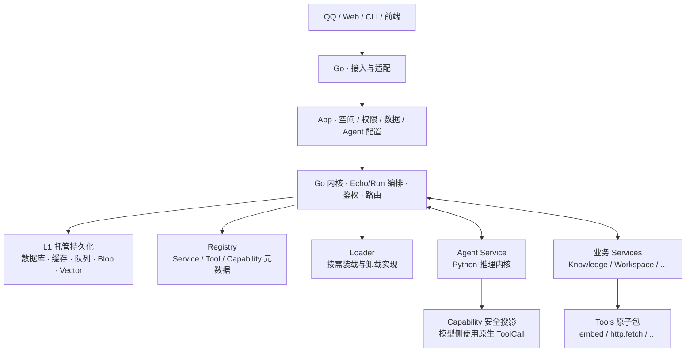
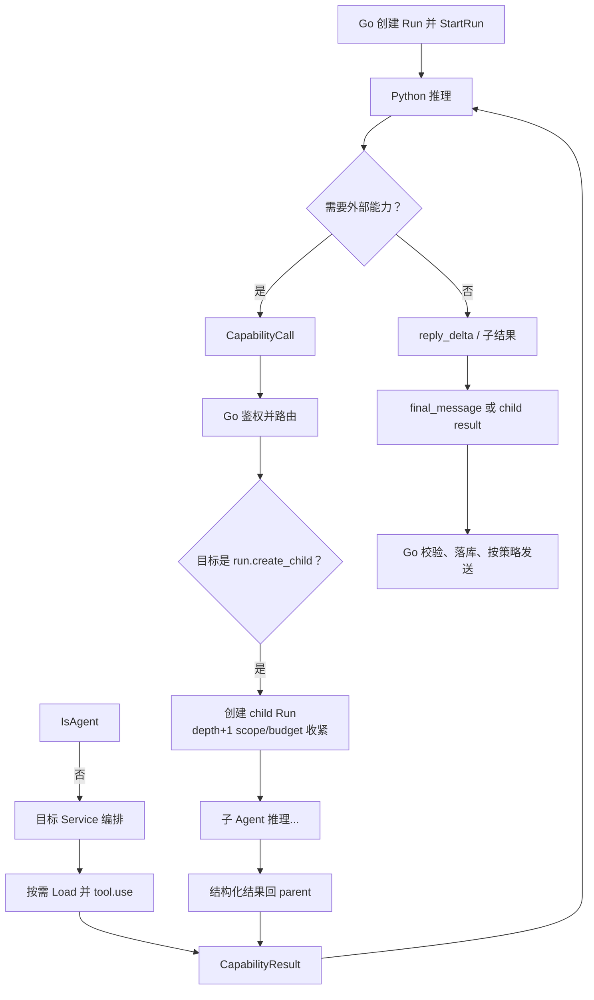

# AI珞（爱珞） V3 总体设计稿

> 状态：第二版讨论稿
>
> 本文用于约定 V3 的总体结构、核心边界、分层模型、Tool/Service 关系与调用规则。具体数据结构、通信协议字段和部署方案在后续设计中细化。

## 一、系统定位

AI珞（爱珞） V3 是一个以 **Go 内核** 为主体、以 Python Agent 为认知能力、以可装配业务服务为扩展面的多入口 AI 助手系统。

Go 是系统唯一核心：负责与前端和外部平台通信、编排用户交互（Echo）、鉴权、路由、队列与调度，并托管全部有状态持久化。Python Agent 内核是由 Go 调用的独立认知服务，只负责一次 Agent 思考过程，不掌握系统事实。

上层不是一批互相封闭的“小程序式”应用，而是：

- **Service（具体服务）**：有业务语义的装配体，对外暴露 Capability；
- **Tool（原子包）**：可被多个 Service 依赖的原子能力，类似包管理器中的 package。

Agent 作为执行者通过 `executor.v1` 接入；root Run 可调用 Core 的 `run.create_child` 形成受治理的 Subagent，但 child Run 不再投影 `run.create_child`，所有子运行仍由 Go 创建与治理。

这里的“Agent 内核”指 Agent 的认知内核，不代表整个AI珞（爱珞）系统的主进程或基础设施中心。

## 二、核心原则

1. **Go 是唯一内核与事实权威**：编排、鉴权、注册、存储托管、与前端/平台通信均由 Go 完成。
2. **逻辑三层，部署正交**：L1 托管持久化、L2 Go 内核、L3 能力面（Service + Tool）；运行模式（embedded / hosted / isolated / remote）与分层正交，不一一对应进程。
3. **持久化只在内核之下**：数据库、缓存、对象存储、向量存储的连接与凭据由 Go 托管；Service 与 Tool 不直接持有业务库凭据，也不发送任意 SQL。
4. **前端与外部平台只连接 Go**：Service / Tool / Agent 不得自建面向用户的 HTTP/WebSocket/QQ 等通道。
5. **Service 与 Tool 分级**：Tool 是原子可复用包；Service 是业务装配与对外 Capability；逻辑复用优先依赖 Tool，而不是复制成全能服务。
6. **注册与装载分离**：启动时全量注册元数据与路由；实现按需懒加载，默认不把扩展包实现塞进 Go 主进程。
7. **懒加载不懒鉴权**：Load 只解决“代码在哪”；每次 Invoke 仍强制鉴权、配额与审计。
8. **调用必须经统一 SDK 与 Go 认可的路由**：禁止服务间保存私有地址并建立秘密通道；embedded 可优化为进程内函数调用，但治理不能省。
9. **权限只收紧、不放大**：下游必须重验权限；内部调用不等于可信提权。
10. **Capability 决定 Agent 的行动边界，原生 ToolCall 表达模型操作**：Agent 不直接枚举或调用底层 Tool；Go 计算本轮可用 Capability，Agent 内核再将其公开入口渐进投影为模型厂商的原生 tools。
11. **AgentService ≠ AgentRun**：Subagent 是带 `parent_run_id` 的 child Run，不是 Python 进程内私开的无鉴权推理环。
12. **反小程序化**：禁止服务自建用户体系、私有数据库、私有消息出口或封闭 UI 通道；新增业务优先“加 Tool + 装配 Service”。
13. **Python Agent 可替换、可横向扩展**，但数据库、外部平台和后台任务不由 Python 直接访问。
14. **user、session、message、platform 是不同领域概念**，不能互相代替；私聊与群聊是 session 形态差异，QQ / Web / CLI 是运行环境差异。
15. **服务是逻辑能力边界**，不等于独立进程、独立端口、独立数据库或独立部署。
16. **统一服务总线是调用规范与治理入口**，不是强制所有流量经过单个网络代理。
17. **Deployment 是物理部署与最高安全隔离边界**；**App** 是数据、权限、Agent 配置和业务空间的隔离边界。不引入额外 Tenant 层级。
18. **服务与 Tool 安装在 Deployment 层并共享实例**；有状态数据默认按 `app_id` 隔离。
19. **跨进程通信采用 gRPC + Protobuf**，不自行设计底层网络传输协议。
20. **先保证边界清晰，再决定是否独立部署**；默认“模块化主程序 + 少量独立运行时”，而不是默认微服务。

## 三、总体结构

### 逻辑三层

```text
                    前端 / QQ / CLI / 其他平台
                              │
                              ▼
┌─────────────────────────────────────────────────────┐
│  L2  Go 内核（Control / Runtime Kernel）              │
│  接入 · Echo/Run 编排 · 鉴权 · 注册表 · 路由 · 队列    │
│  与前端/平台的通信也在这里                             │
└───────────────┬─────────────────────┬───────────────┘
                │                     │
                ▼                     ▼
┌───────────────────────┐   ┌─────────────────────────┐
│  L1  托管持久化        │   │  L3  能力面              │
│  DB · Cache · Blob    │   │  Service（业务装配）      │
│  Vector · EventLog    │   │  Tool（原子包，可懒加载）  │
│  仅 Go 持有凭据        │   │  Agent 亦为一种 Service   │
└───────────────────────┘   └─────────────────────────┘
```



说明：

- **L1** 有状态，权威数据落在这里；物理库表与连接池由 Go 管理。
- **L2** 无业务故事，只做系统治理与编排；前端只连 L2。
- **L3** 默认无本地权威状态：业务数据经 Storage API 写入 L1；扩展实现按需加载，不默认常驻 Go 主进程。
- Agent 与其他 Service 在注册表中同级；Agent 运行时额外拥有 Run 状态机与双向流协议。

### Deployment 与 App

Deployment 表示一套实际运行的AI珞（爱珞），包括 Go 主程序、Python Agent、数据库、Service Host、Tool 包目录和全部已安装清单。它是物理部署和最高级别的安全隔离边界。

App 是 Deployment 内最细粒度的业务、数据和权限隔离单位。学院、研究生院、研讨会、智慧珞珈或 Luotopia 等具体需求，可以成为独立 Deployment，也可以成为同一 Deployment 下的不同 App。

```text
Deployment
├─ 共享基础设施（L1 + 队列等）
├─ 共享 Registry（Service / Tool / Capability 元数据）
├─ 共享 Loader 与 Service Host / Worker 池
├─ Deployment 内部用户
└─ App[]
   ├─ spaces：接入的一个或多个外部空间
   ├─ members：成员及角色
   ├─ permissions：App 权限规则
   ├─ agent_config：模型、提示词和人格
   ├─ enabled_services：启用的服务
   ├─ sessions：App 内会话
   └─ data_namespace：App 数据命名空间
```

一个 App 可以接入多个平台空间，只要这些入口共享数据、权限和 Agent 配置。增加新入口不需要创建新的权限层级；当数据、权限或 Agent 配置需要独立时，才创建新 App。

服务与 Tool 在 Deployment 层安装一次，由多个 App 共享代码与运行时资源，不共享各 App 的私有业务数据。

## 四、Go 内核

Go 内核统治系统资源与交互编排，是AI珞（爱珞）运行时的 OS。

### 内核子系统

```text
Go Kernel
├─ Access           前端 / QQ / CLI 协议、连接与推送
├─ Echo / Run       用户交互与 Agent 运行生命周期
├─ AuthZ            身份、AppMembership、权限交集
├─ Registry         Service / Tool / Capability 注册与发现
├─ Router           ctx.call / ctx.tool.use 的调度入口
├─ Loader           实现的 Load / Unload / 预热 / pin
├─ Storage Host     持久化、迁移、配额
├─ Queue / Scheduler 可靠事件、重试、定时任务
└─ Observe          日志、指标、链路追踪、审计
```

业务规则（如何切片知识库、提醒如何过期）放在 Service；原子操作放在 Tool；基础设施与治理留在 Go。

### 主要职责

- 接收和发送 QQ、Web、CLI、前端等外部消息；**所有面向用户的连接终止于 Go**。
- 将平台原始事件转换成标准 user、session 和 message。
- 管理用户账户、外部身份绑定和登录状态。
- 管理 session、消息历史及其外部平台绑定。
- 管理权限、Service/Tool 安装状态、Capability 可见性。
- 托管数据库、缓存、消息队列和对象/向量存储。
- 运行并发控制、定时任务、后台任务和重试。
- 维护 Registry 元数据，并按策略懒加载实现。
- 选择是否启动 Agent，构造安全投影后的 RunInput。
- 调用 Python Agent 内核，管理 Run / Subagent 生命周期。
- 接收 Capability 与 Tool 调用请求，鉴权后路由执行。
- 对最终结果执行持久化、风控、格式适配和平台/前端发送。
- 统一完成日志、指标、链路追踪和审计。

Go 对所有系统状态拥有最终解释权。Python 与扩展包返回的是建议、调用请求或生成结果，不能直接改变系统事实。

## 五、Python Agent 内核

Python Agent 内核负责一次 Agent 运行中的认知闭环，通过 `executor.v1` 接入；创建 child Run 的 `run.create_child` 是 Core 能力，不是 Python Service 自有路由。

### 主要职责

- 根据运行输入选择模型和模型参数。
- 组织系统提示词、会话上下文和记忆上下文。
- 判断是否需要激活或调用外部 Capability。
- 将 Capability 的公开入口转换为模型原生 tools，并把模型原生 tool call 还原为结构化能力调用请求（含对 `run.create_child` 的 Subagent 请求）。
- 接收能力调用结果并继续推理。
- 流式生成回复内容。
- 产生标准最终消息（root Run）或结构化子结果（child Run）。
- 保留本轮临时运行状态和可观测语义事件。

### 明确不负责

- 直接连接 QQ、网页、前端 WebSocket 或其他外部平台。
- 直接读取或修改业务数据库，或持有业务库凭据。
- 直接运行系统后台任务。
- 直接管理用户、session、权限或安装状态。
- 绕过 Go 调用其他服务或私自加载 Tool 实现。
- 直接枚举 Registry 中的全部 Tool。
- 决定消息最终如何发送到平台或前端。
- 成为聊天历史或业务状态的唯一存储位置。
- 在进程内私开不受 Go 管理的子 Agent 环以规避鉴权与预算。

Python 侧应尽量保持无状态。进程重启后，权威数据仍可由 Go 重新提供；正在运行的任务由 Go 根据协议决定失败、取消或重试。本轮 scratch 可留在内存，权威结论必须回写 Go。

## 六、Service 与 Tool

L3 拆成两级，避免“每个业务一个封闭应用”或“所有逻辑都平铺成互调服务”。

### 分级定义

```text
Tool（原子包）
├─ tool_id：稳定标识，如 embed.text、http.fetch
├─ version
├─ input_schema / output_schema
├─ side_effect：none | read | write | external
├─ required_permissions：最小权限
├─ run_mode：embedded | hosted | isolated | remote
├─ entrypoint：实现入口
├─ healthcheck / resource_hints
└─ 特点：无完整业务故事、可被多处依赖、尽量单一副作用边界

Service（具体服务 / 装配体）
├─ service_id：如 knowledge、reminder、agent
├─ version
├─ tools[]：依赖的 Tool 及版本约束（类似 package 依赖）
├─ capabilities[]：对外门面（给 Agent 与其他 Service）
├─ required_services[]：确需跨业务协作时的 Capability 依赖
├─ requested_permissions
├─ storage_requirements：数据命名空间与 schema
├─ run_mode / entrypoint
└─ 特点：编排 + 业务策略；薄；不持有前端通道与 DB 凭据
```

类比：

| 包管理器          | AI珞（爱珞）                 |
| ----------------- | -------------------- |
| package / crate   | Tool                 |
| 应用 / 产品用例   | Service              |
| dependencies      | ServiceSpec.tools    |
| registry          | Go Registry          |
| install / resolve | 安装与依赖解析、lock |
| 运行时加载        | Loader 懒加载实现    |

### 目录形态

```text
tools/
├─ http.fetch/
│   ├─ tool.yaml
│   └─ entrypoint
├─ embed.text/
└─ weather.openmeteo.tool.py          # 单文件 Tool 亦可

services/
├─ weather/
│   ├─ service.yaml                   # depends_on tools，暴露 capabilities
│   └─ handlers/                      # 薄编排
├─ knowledge/
│   ├─ service.yaml
│   └─ handlers/
└─ agent/                             # Agent 亦为 Service
```

`service.yaml` 逻辑示例：

```yaml
service_id: knowledge
version: 1.0.0
tools:
  - id: embed.text
    version: ">=1.2.0"
  - id: vector.search
    version: "^1.0.0"
capabilities:
  - id: knowledge.search
    uses: [embed.text, vector.search]
storage:
  namespace: knowledge
  schema_version: 1
  entities:
    - name: chunk
      indexes: [document_id, updated_at]
```

上文 `services/`、`tools/` 是**安装包形态**（yaml + 入口，部署到安装根目录）。仓库内的**测试装配与内核机制**按同一角色命名空间组织，生产包实现不进入 `internal`：

```text
internal/
├─ kernel/            L2 Go 内核（治理/编排/协议/Loader/存储端口）
├─ access/ storage/ observe/   平台接入 · L1 适配器 · 可观测性
└─ services/          仍在迁移期的内核服务装配

testsupport/
└─ campus/            校巴包测试夹具（IDs/schema 副本 + hosted 装配）
   ├─ specs.go        测试使用的稳定契约构造器
   └─ campustest/     测试装配（guest 源码 testdata 内嵌、测试时现场编译）
```

可安装包源码在包工作区（如 `packages/campus-bus`，guest 自包含只依赖标准库），经 `ailuo pack [build]` 交叉编译、`ailuo install` 安装后从安装目录装载。Core 只保留通用测试固件；校巴 hosted 装配位于 `testsupport/campus`，不提交任何 wasm 工件，也不把示例 Package 当作内核内置组件。

共享规则：Tool 是全局目录，任何 Service 声明 `ToolDependencies` 即可复用同一 handler；可被第二个 Service 复用的原子能力进 `internal/tools`，服务专属装配留在 `internal/services`，工具包绝不反向依赖服务。有状态包的持久化统一经 `internal/kernel/packstore` 窄端口（`ailuo.store` 宿主函数背后，作用域 = App × 包 namespace）；新增有状态包零内核改动。

### 调用关系

```text
Agent / 其他 Service
        │  只看见 Capability（门面）
        ▼
   Service（业务编排）
        │  ctx.tool.use("embed.text", payload)
        ▼
   Go Kernel（鉴权 · 配额 · 懒加载 · 审计）
        │
        ▼
   Tool 实现
        │  需要数据时
        ▼
   Go Storage / 外部适配（仍经 Kernel）
```

规则：

1. **对外**默认只暴露 Service 的 Capability（及少数系统 Capability，如 storage 对内核内部的封装）。
2. **对内** Service 通过 `ctx.tool.use` 使用 Tool，不 import 其他 Service 的内部实现。
3. **逻辑复用走 Tool**；**跨业务协作走 Capability**（`ctx.call`）。
4. Tool 默认不调用 Service；若必须协作，只能再走 Capability，并计入调用深度。
5. Agent **不得**直接获得完整 Tool 目录；其行动范围由 Go 下发的 `available_capabilities` 决定，模型侧通过这些 Capability 投影出的原生 tools 发起调用。

### 反小程序化约束

Service 不得演变为封闭小应用。明确禁止：

| 禁止事项                 | 说明                                                       |
| ------------------------ | ---------------------------------------------------------- |
| 自建用户/Token 体系      | 身份只在 Go；Service 只接收安全投影                        |
| 自建前端通道             | 不得独自提供用户侧 HTTP/WS；事件用`ctx.emit`，由 Go 推送 |
| 自持数据库凭据           | 只声明 storage schema，经`ctx.storage.*`                 |
| 私自触达外部平台         | 发 QQ/邮件/推送等走系统能力，经 Go Access                  |
| 把可复用逻辑封死在服务内 | 多处需要的能力下沉为 Tool                                  |
| 巨型全能服务             | UI + DB + 业务 + Agent 捆成一体                            |

新增业务的默认路径是：**增加或版本化 Tool → 装配或扩展 Service → App 启用**，而不是新开一套带私有状态与私有入口的进程应用。

### 原子性约定

好的 Tool 应接近“一个可测试的副作用边界”，例如 `vector.search`、`document.put`、`http.fetch`。
带完整故事的流程（先搜再摘要再写入记忆）属于 Service 编排或 Agent，而不是单个 Tool。

若某逻辑仅一个 Service 使用且尚无复用证据，可暂留 Service 私有实现；出现明确多处复制时再抽为 Tool，避免过早包化。

## 七、逻辑服务划分

以下为常见逻辑 Service。它们不要求全部独立部署，也不要求启动时全部装入实现。

### 接入（Access）

平台协议、连接管理、事件接收、消息发送和格式转换。原始平台事件只停留在 Go 一侧。Access 属于内核能力，不是可被业务随意替换的扩展小程序。

### 用户与身份

AI珞（爱珞）用户、账户资料、外部身份绑定和身份归一。外部平台 ID 不能直接作为内部 `user_id`。

交互入口不支持匿名用户。任何用户发起的消息都必须在创建 Session、Message 和 Echo 前，由 Go 通过可信登录态或外部身份绑定解析为内部 `user_id`；缺少身份、身份未绑定、用户被禁用或 AppMembership 无效时一律拒绝，不得创建保留匿名用户、共享匿名会话或临时权威身份。Web 请求体中的 `user_id`、`user_name` 和 `session_id` 不能充当身份凭据；Web 登录边界尚未实现时，聊天入口必须 fail closed。平台适配器的机器认证与消息发送者身份解析是两个独立边界，前者不能替代后者。

校巴首期“不依赖用户态数据”只表示校巴 Capability 不读取或持久化乘车记录、偏好等业务用户数据，不表示接入层允许匿名调用。

User 可在 Deployment 内统一存在，角色与权限通过 AppMembership 归属具体 App：

```text
AppMembership
├─ app_id
├─ user_id
├─ roles
└─ permissions
```

### Session 与消息

session 元数据、成员关系、标准消息、回复关系和完整历史。每个 session 必须属于一个 App。私聊与群聊是不同 session 形态；平台来源不是 session 类型。

### 权限与能力

权限方案、细粒度授权、Service/Tool 注册发现、安装状态、Capability 路由，以及向 Agent 下发的可见能力列表。

### 记忆与上下文

用户长期记忆、session 上下文、Agent 全局记忆及其读写规则。Agent 可请求读取或建议写入，最终由 Go 审核执行。

已实现基线（2026-08-13）：`internal/kernel/contextasm` 按 Run 构造确定性上下文快照——配置系统提示修订 + 当前标准消息 + 受限会话历史 + 当前 Capability 投影，执行条目数/字符数/时间范围/提示总大小预算（保留最新、丢弃最旧，只记录数量不记录正文）。快照摘要（sha256，墙钟时间不进入摘要）与来源版本固化到 Run 记录（`context_digest`/`context_sources`，迁移 19），支持恢复与审计；`run.context` 事件携带摘要与数量。会话上下文只来自受治理的平台接入入口，客户端无法伪造；子 Run 为干净工作区（不装配历史）但仍固化自身上下文摘要。知识库证据与授权长期记忆分属独立模块，落地后按同一契约扩展装配输入。

### 业务能力服务

知识库、文件、提醒、搜索、图像、工作区等。以 Service 形式存在，内部装配 Tools；跨业务时通过 Capability 协作。

### 任务与调度

定时、延迟、队列消费、失败重试和周期性维护。任务可调用业务 Capability，也可在条件满足时发起 Agent Run。

### Agent 服务

模型推理与工具调用循环；由 Go 按需调用；当前仅 root Run 可通过 `run.create_child` Capability 创建一层受治理 Subagent，root 可并行创建多个直接 child，child 不可继续派生。

## 八、即插即用与包管理

V3 的即插即用是 **协议级包机制**：Service 与 Tool 遵守同一套发现、注册、依赖与调用规范，而不是由中央代码为每个扩展写死分支。

### 清单

**ToolSpec** 至少包括：`tool_id`、`version`、`protocol_version`、`language_runtime`、`run_mode`、`entrypoint`、输入输出 schema、`required_permissions`、`side_effect`、`healthcheck`、资源提示。

**ServiceSpec** 至少包括：

```text
ServiceSpec
├─ service_id
├─ version
├─ protocol_version
├─ language_runtime
├─ run_mode
├─ entrypoint
├─ tools[]：依赖的 Tool 及版本约束
├─ capabilities[]：对外能力
├─ required_services[]：跨业务 Capability 依赖（可选）
├─ requested_permissions
├─ storage_requirements
├─ warmup_tools[]：建议预热的 Tool（可选）
├─ healthcheck
└─ lifecycle
```

安装或解析时生成 **lock**（逻辑 lockfile）：运行时只装载已锁定版本，避免懒加载瞬间重新解析 semver 导致漂移。

### 统一生命周期接口

Service / 可托管 Tool 宿主侧至少支持：

- `Describe`：返回清单与能力/工具描述（元数据）。
- `Start`：实现被装载后的初始化（进入 Ready）。
- `Health`：健康与就绪。
- `Invoke`：处理一次标准请求。
- `Stop`：停止新请求并安全退出（Unload 前）。

Go 管理器负责：

1. 扫描约定目录或接收安装包，校验清单与签名/哈希。
2. 解析 Service 对 Tool 的依赖并锁定版本。
3. 将元数据写入 Registry（**此时不必 Load 实现**）。
4. 将 Capability 路由注册到网关。
5. 在首次使用或预热策略触发时 Load 实现并完成 Start/Health。
6. 在停止、升级、空闲或异常时 Unload/注销，并处理在途请求。

### SDK

```text
ctx.call(capability_id, payload)     # 跨 Service / 系统能力
ctx.tool.use(tool_id, payload)       # Service 内使用原子包
ctx.storage.put / get / query / ...
ctx.emit(...)
ctx.is_cancelled()
```

SDK 自动继承 `echo_id`、`app_id`、调用身份、权限范围、deadline 与链路信息。开发者不为懒加载手写 `load()`；装载由 Kernel Loader 透明完成。

### 核心与扩展

- **核心 Service/Tool**：系统启动所必需，可 pin 常驻，不可在运行中随意卸载。
- **扩展 Service/Tool**：可安装、禁用、升级、卸载；实现默认可懒加载与空闲卸载。

## 九、运行模式与懒加载

### 运行模式

逻辑单元与 OS 进程必须分开理解。Registry 中可以有很多 Service/Tool，不应因此启动同样数量的进程与连接池。

| 运行模式     | 物理形态                | 主要用途                               | 特点                                  |
| ------------ | ----------------------- | -------------------------------------- | ------------------------------------- |
| `embedded` | 编译或加载到 Go 主进程  | 鉴权、Session、Storage 路由等核心      | 最快，但扩大主进程面积，扩展包慎用    |
| `hosted`   | 多插件共享 Service Host | 同语言、低风险、轻量 Tool/Service      | **扩展包默认首选**；按需 attach |
| `isolated` | 独占本机进程            | Python Agent、重依赖、高资源或不可信包 | 故障隔离；冷启动更明显                |
| `remote`   | 其他机器                | GPU、跨机共享、独立扩缩容              | 第一阶段不主动使用                    |

初期推荐物理结构：

```text
Go 主进程（瘦内核）
├─ embedded：AuthZ、Session、Storage Host、Registry、Loader、Access、调度
├─ hosted：扩展 Tool/Service 的少量 Host（按语言/风险分池）
└─ isolated：Python Agent 等
```

只有在需要单独扩缩容、运行时冲突、强隔离、极大资源占用或独立发布周期时，才拆独立进程或 remote。

### 注册与装载分离

```text
Install     包落盘、校验、写入可安装清单
Register    元数据进入 Registry（常驻）；实现未加载
Resolve     解析 Service→Tool 依赖闭包与 lock
Load        首次使用或预热时装入实现
Invoke      热路径执行
Unload      空闲/内存压/版本替换后释放实现；元数据仍可保留
```

**Registry 全量，Runtime 按需。** Go 主进程常驻的是目录、路由、鉴权与 Dispatcher stub，不是全部扩展实现。

### Loader 状态

```text
ToolRuntimeState / ServiceRuntimeState
├─ id + version
├─ state: registered | loading | ready | unloading | failed
├─ refcount / in_flight
├─ last_used_at
├─ endpoint: embedded_fn | host_slot | process_handle
└─ pin: bool
```

```text
Registered ──(first use / warmup)──► Loading ──► Ready ──► Invoking
                                      │            │
                                      ▼            ├── idle TTL ──► Unloading ──► Registered
                                   Failed          └── 版本替换 drain 后 Unload
```

约束：

- 并发首次调用同一实现时 **单飞 Load**，避免惊群。
- `in_flight > 0` 时不 Unload；升级时新版本接新流量，旧版本 drain。
- Load 失败标记 `failed`，对应该 Capability/Tool 的调用快速失败，不拖垮内核。
- Load 前校验 Install 时记录的清单哈希/签名；禁止运行时从任意 URL 拉码执行。

### 加载策略

| 策略            | 触发                                     | 用途                         |
| --------------- | ---------------------------------------- | ---------------------------- |
| Eager           | 进程启动                                 | 核心 pin 项                  |
| App-enable 解析 | App 启用 Service                         | 计算 tool 闭包；可选后台预热 |
| Run 预热        | 创建 Agent Run / 下发 capabilities       | 与首轮推理重叠，掩盖冷启动   |
| First-use       | 第一次`ctx.tool.use` / Capability 命中 | 长尾包                       |
| 显式 warmup     | 运维或发布钩子                           | 预热指定集合                 |

默认组合：启动只 Eager 核心；创建 Run 时对本轮 `available_capabilities` 依赖的 Tool 做有限并发异步预热；真正调用时若未 Ready 则在 deadline 内同步 EnsureLoaded；非 pin 项按 idle TTL 与内存水位 Unload。

**Load 粒度**：按本次调用需要的 Tool 闭包装载，而不是“启用某 Service 就装齐其声明的全部 Tool”。Service 可用 `warmup_tools` 区分入口必热与长尾。

当前内核已经实现与具体 Host 解耦的 Loader 状态机：安装锁以稳定 ID、语义版本、运行模式和 SHA-256 digest 表达；Host 必须先校验已经安装的本地单元，再允许 Load。首次 `EnsureLoaded` 单飞执行 `Verify -> Load -> Describe -> Start -> Health`，失败进入快速失败状态；若失败清理的 Stop 也失败，Loader 保留句柄供 Shutdown 再次清理。Registry handler 适配器仍位于统一 Dispatcher 的 Schema、App 策略、权限、副作用和幂等治理之后。

Acquire/Release 维护在途引用，引用非零时拒绝 Unload；pin 项不参与 idle TTL 回收。Upgrade 在候选版本完全 Ready 后原子切换新调用，再按 deadline 等待旧版本 drain；超时不会丢失旧句柄，最终 Shutdown 会同时清理活动版本与退休版本。Shutdown 先停止新 Acquire，再有界等待 Load/Unload/Invoke 排空。Loader 只接受 `embedded`、`hosted`、`isolated`，明确拒绝 `remote`。

`proto/runtime_host.proto` 已定义并生成 Runtime Host 2.0 Unary 契约，覆盖 `Describe / Start / Health / Invoke / Stop`。每个响应都回显精确的 runtime ID、版本和协议版本；两端拒绝未知字段、身份错配、非法生命周期顺序、过期或异常远期 deadline、超限上下文与载荷。Invoke 传递 `app_id`、Echo/Run/父 Run、`request_id`、`trace_id`、`call_id`、权限范围、调用链、幂等键、确认标识，以及闭式 `target_type` 和相匹配的 `capability_id / service_id / tool_id`；Host 因此不需要从载荷猜测目标。失败响应只含闭式稳定错误码与重试标志，不允许 Host 自由文本错误进入内核。

Go 侧 `GRPCHost` 只接受绝对 Unix Socket 或 loopback 地址，并给收发消息、调用参数和结果设置独立上限。hosted 模式复用单条连接，同时以显式 runtime 槽位和并发 Invoke 上限做快速背压；isolated 模式每个 Runtime 独占连接。Host 返回 `Unavailable` 或协议违例时，Loader 把对应实现置为 `failed`，保留句柄且停止继续接单；`RecoverFailed` 只有在在途调用排空并完成 Stop 后才允许下一次重新加载。

宿主侧 `RuntimeHostProtocolServer` 是同一 Protobuf 契约的生产校验适配器：它再次校验身份、未知字段、上下文、deadline、载荷、生命周期顺序、在途 drain 和容量，并把 Backend 原始错误压缩为固定 gRPC 状态或稳定 Invoke 错误码。宿主 gRPC server 必须使用该包提供的 512 KiB 收发上限选项。

isolated 扩展由 Go 通用 `ProcessHost` 启动。可执行文件、参数、工作目录和 Socket 只能来自受信任的已安装解析器，并在执行前再次按 lock 校验；路径必须绝对、非符号链接且不可被组或其他用户写入，Socket 必须位于该私有工作目录。子进程不继承 Go 环境，标准输出/错误被抑制，避免第三方明文绕过集中日志。Stop 先走协议宽限期，再有界发送进程组终止和强制结束，并只清理由该规格绑定的 Unix Socket。真实跨进程集成测试覆盖正常退出和忽略 Stop 后的强制清理。

安装目录使用 `ailuo.package.v2` 清单与 lock。内核只接受由有效进程用户持有、目录链和文件均不允许组或其他用户写入、没有符号链接的绝对目录；严格拒绝未知字段、重复 JSON 键、超限文件、非法稳定 ID、跨目录路径和不完整引用。lock 同时固定清单原始字节与实现文件的 SHA-256；isolated 还固定完整进程规格。发现结果先作为一批完成 Runtime、Tool、Service、Capability 全量校验，再分别原子发布到 Loader 与 Registry，Registry 冲突时回滚 Loader 发布。主程序通过 `AILUO_RUNTIME_INSTALL_ROOT` 启用恢复；未显式设置时回退用户配置目录 `ailuo/runtime`（与 `ailuo install` 默认位置一致，目录不存在则视为未配置）。hosted 分两条装载路径：声明宿主函数的包只能在内核进程内由 wazero 执行（宿主函数是内核特权，不出进程）；未声明宿主函数的 hosted 包才经外部 Runtime Host 装载，此时必须提供本机 `AILUO_RUNTIME_HOST_ADDRESS`，否则启动 fail-closed。启动只预热 `pin` 项，失败则整个内核拒绝就绪；非 pin 项保持首次调用懒加载。已注册 Capability 不会自动进入任何 App，仍须通过持久 App 配置显式启用。

上述实现完成了可长期保留的 Runtime Host 协议、Go 客户端/宿主校验器、Wazero hosted Backend、`runtime-host` 外部进程形态、持久安装目录发现与内核启动重注册、hosted 连接与容量边界，以及 isolated 真进程监管，但还不等于完整包平台已经交付。仓库尚未提供更多扩展语言或包格式的专用生产 Backend；hosted 共享进程的 CPU、内存和文件系统级资源隔离也需结合最终 Deployment 方案完成。安装目录属主校验已覆盖 Unix 与 Windows，其他平台仍关闭失败。Python Executor 位于 `packages/agent`，通过通用 `ProcessHost` 以 `executor.v1` isolated Runtime 形态纳管；Core 的 child Run 控制能力由 `internal/kernel/echo` 注册。产品链路接入新的扩展 Backend 并完成对应恢复和资源限制验证前，不得把测试夹具描述成已上线扩展。

2026-08-12 三模式接入基线：三种运行模式已由 Loader 统一接入，**campus 完全重构为 hosted 包（无旧兼容），并已迁出 Core 实现目录为 `packages/campus-bus`，经安装目录装载**：

- **hosted 生产 Backend = wazero 进程内沙箱**（`internal/kernel/loader/wasm_host.go`）。业务扩展包默认形态：wasm32-wasi 工件经线性内存上限（默认 128 MiB）与 WASI 裁剪（无文件系统/网络/环境变量）执行，每次调用独立实例（零共享状态），stdin/stdout JSON 信封 ABI（`{tool_id,payload}` → `{ok,result,code,message}`）。guest 需要内核能力时经宿主函数（host function）投影，线性内存 ABI + 按调用绑定的治理上下文（guest 无法伪造 app_id/权限）；`CapabilitySpec.ToolID` 让 Dispatcher 把 Capability 直接执行的工具注入治理上下文，运行时级 Handler 据此分发。包的持久化统一经 `ailuo.store` 宿主函数（`internal/kernel/packstore` 端口：作用域 = App × 包 namespace，get/list 响应内嵌单事务一致的快照元数据，快照原子替换仅对可信 Go 侧开放），业务治理（数据权威性/新鲜度校验）留在 guest——campus-bus guest 自包含、只依赖标准库，新增有状态包零内核改动。
- **embedded 机制**（`embedded_host.go`）：进程内 Runtime，供内核自有组件以包形式纳入统一治理；当前无生产业务包，机制完整并有测试。
- **isolated 资源限额**：`ProcessSpec.Limits`（RLIMIT_AS/CPU/NOFILE/FSIZE）由锁固定，Linux 用 prlimit 在子进程启动后立即应用，其余平台对非零限额 fail-closed。
- **Agent 定位（目标结构）**：Python Agent 是普通的 `executor.v1` Package/Service 实现；Go Core 只通过 `internal/kernel/executor` 契约和通用 `internal/kernel/loader.ProcessHost` 接入，不 import Agent 实现。child Run 控制能力由 Core 自己注册为 `run.create_child` / `run.get_child_status`，不由 Agent Service 提供。`loader.New(hosts ...Host)` 持有全部运行模式宿主，main.go 只装配一个共享 Manager，不按包分叉 Loader。
- 安装目录发现支持 Unix UID 与 Windows ACL SID 属主校验，其他平台仍关闭失败。hosted 工件 CPU 指令级预算与外部 Runtime Host 进程形态接线保留为后续 P1。

### 防止微服务化失控

除非明确评估，逻辑 Service/Tool 不得自行拥有：

- 独立数据库和数据库凭据；
- 独立消息队列；
- 私有服务发现与私有内部地址；
- 重复建设的权限、重试、日志和配置系统；
- 面向用户的独立接入层。

新增逻辑单元不代表新增部署单元。是否拆分进程是运行时决策，不改变公开契约。

## 十、服务通信模型

### 统一总线

统一服务总线包括：

- 统一的调用上下文与消息结构；
- Go 维护的 Registry、路由、权限、超时与审计；
- 各语言统一 SDK；
- 按 run_mode 选择的实际通路（进程内 / Host / 本机 gRPC / 网络 gRPC）。

```text
统一 SDK
├─ embedded：进程内函数调用（仍经鉴权与 trace 钩子）
├─ hosted：路由到 Service Host 槽位
├─ isolated：本机 gRPC
└─ remote：网络 gRPC
```

服务之间不得保存其他服务私有地址并直连。

### 调用图治理

“可以互调”不等于“任意 mesh”。

| 规则         | 要求                                                                           |
| ------------ | ------------------------------------------------------------------------------ |
| 唯一入口     | 一律`ctx.call` / `ctx.tool.use`                                            |
| 同步最大深度 | 有限深度（具体数值后续约定）；过深转异步 Task                                  |
| 允许节点重入 | 不因调用链再次出现同一 Service / Capability 就拒绝；`A→B→A` 可以是合法编排 |
| 非推进环检测 | 当前活动祖先链出现相同调用指纹，且没有可证明的状态推进时，终止最内层重复调用   |
| 幂等去重     | 相同幂等键的已完成调用复用结果；仍在执行的调用合并等待或快速失败，不重复执行   |
| 权限传递     | 只收紧不放大；下游重验                                                         |
| 副作用重试   | 默认不自动重试；需幂等键显式允许                                               |
| 可见性       | 被调方不能仅因“内部调用”获得调用方全部权限                                   |

判环同时使用“最大深度”和“非推进重复”两道约束。最大深度是无条件兜底；环检测不能只比较 Service 或 Capability 标识，否则会误杀合法的递归、回调和分阶段编排。

这里所说的“幂等环”是指**同一语义调用状态再次出现**，而不只是 Capability 在清单中声明为幂等。Go 为每次调用计算调用指纹，至少包括：

```text
CallFingerprint
├─ target + operation + version
├─ canonical_payload_hash
├─ app_id / user_id / session_id
└─ effective_permission_scope_hash
```

调用指纹只在同一活动调用祖先链（包括 Subagent Run 树）中比较，因此不包含每次都会变化的 `run_id`、`request_id`、`call_id`、传输时间戳和 trace 字段，否则每次重入都会看起来不同。分页游标、剩余深度、状态版本等业务推进量属于 payload；只要它们发生有效变化，就不是相同指纹，可在最大深度内继续调用。

幂等键与调用指纹用途不同：调用指纹用于发现当前活动链中的非推进环；`idempotency_key` 用于在重试、重复投递或并发请求之间定位同一次副作用并复用结果。调用方不能仅靠更换幂等键绕过判环。

处理规则：

1. 同一指纹已经存在于当前活动祖先链，且 Capability 未声明可重入或没有进展证明：判定为非推进环，终止最内层调用并返回结构化 `cycle_detected`。
2. 相同 `idempotency_key` 的调用已经成功完成：直接复用已保存结果，不再执行。
3. 相同 `idempotency_key` 的调用仍在执行：合并等待原调用；若等待会形成依赖自身的环，则快速返回 `cycle_detected`。
4. Service / Capability 标识重复但调用指纹不同：不判环，仅继续累计 `call_depth`。
5. 写入、删除、发送等非幂等副作用不能因为“指纹不同”就无限重入；默认禁止自动重试，并要求显式重入策略、幂等键或可验证的进展字段。

因此，治理目标不是禁止拓扑上的环，而是阻止没有语义进展的重复执行。是否“杀掉”由活动调用链上的语义指纹与进展共同决定，深度上限负责兜住无法可靠判定的动态环。

优先：

```text
Service → Tool（复用）
Service → Capability → Service（跨业务）
避免 Tool → Service 成为常规路径
```

### 顶层 Echo

每个从用户侧发起、最终回到用户侧的完整交互拥有全局唯一 `echo_id`。

Agent 对话、注册、上传文件、置顶对话、修改设置等均属于 Echo。Agent Run 只是 Echo 中可能出现的子过程。

```text
Echo
├─ echo_id
├─ app_id
├─ 一次用户请求
├─ 零到多次内部服务 / Tool 调用
├─ 零到多次 Agent Run（含 Subagent 树）
├─ 零到多次数据库或文件操作
├─ 零到多次流式事件
└─ 一个最终状态
```

同一次 Echo 内的内部请求、运行事件、日志、审计和用户响应携带同一 `echo_id`。内部自动重试保留 `echo_id`，更换 `request_id`；用户重新发起操作产生新的 `echo_id`。

### 调用上下文

```text
RequestContext
├─ echo_id
├─ app_id
├─ request_id
├─ trace_id
├─ caller
├─ user_id（可空）
├─ session_id（可空）
├─ run_id（可空）
├─ parent_run_id（可空，Subagent 时）
├─ permission_scope
├─ call_depth
├─ deadline
├─ idempotency_key（可空）
└─ protocol_version
```

### 统一消息类型

底层协议只定义五种 Frame，不为数据库、Agent、缓存分别发明传输层：

```text
Frame
├─ invoke
├─ result
├─ event
├─ cancel
└─ control
```

差异由 `target + operation` 表达：

```text
target=agent       operation=run
target=storage     operation=document.put
target=knowledge   operation=search
target=tool        operation=embed.text
```

```text
Invoke
├─ context：RequestContext
├─ target
├─ operation
└─ payload
```

### gRPC 与 Protobuf

- 普通调用：gRPC Unary。
- 一次 Agent Run：独立双向流，交换能力请求/结果、回复片段、取消与最终消息。
- 本机优先绝对 Unix Socket，也可使用 loopback；当前实现拒绝 Runtime Host 的非本机明文地址，尚不支持跨机器 Runtime Host。
- 连接复用；不为每次调用新建连接。

执行者流使用 `proto/executor.proto`；Service/Tool Runtime Host 使用 `proto/runtime_host.proto`。两者都是独立版本化契约，不能用其中一个的版本字段替代另一个的协商与校验。

不自行设计底层高速协议。异步后台任务第一阶段不强制引入外部消息中间件；普通同步调用与 Agent 流不因引入队列而全部改走队列。

### Payload

外层 Frame 用 `oneof` 区分类型。第一阶段：

- 核心高频协议用明确 Protobuf 消息；
- 扩展插件可用带 `type`、`schema_version` 与 JSON Schema 的 JSON Payload；
- 后续可用 Protobuf `Any` 增强扩展类型。

### 同步与异步

- 同步：查询、Agent 运行、需要立即返回的能力调用。
- 异步：后台任务、通知、审计、状态变化、长链路编排。

异步消费按可能重复投递设计；有副作用的消费者必须使用 `echo_id`、`request_id` 或业务幂等键。

## 十一、统一存储模型

### 原则

Go 托管数据库、缓存、对象存储、向量存储的连接、凭据、连接池、备份和迁移。Service/Tool 不直接持有业务库凭据，不发送任意 SQL。

服务只声明：保存什么、属哪个服务命名空间（`app_id` 由上下文注入）、按何字段查询、索引与唯一约束、是否要事务/版本/幂等、隐私级别与保留策略。Go 存储层决定落在 PostgreSQL、JSONB、对象存储、缓存或向量库。

### 能力

```text
Storage
├─ document.put / get / query / delete
├─ document.compare_and_set
├─ transaction.execute
├─ blob.put / get / delete
├─ vector.upsert / search / delete
└─ event.append / read
```

```text
ctx.storage.put / get / query / transaction
ctx.blob.put
ctx.vector.search
```

### 核心数据与扩展数据

- **核心领域数据**：User、Session、Message、Permission、Echo 等，Go 强类型模型与专用 Repository。
- **扩展服务数据**：按 `app_id + service_id` 隔离的 DocumentStore；文件走 Blob，向量走 Vector Store。

```yaml
storage:
  namespace: reminder
  schema_version: 1
  entities:
    - name: reminder
      indexes: [user_id, trigger_at, status]
      unique: [reminder_id]
      retention: permanent
      sensitivity: private
```

实际命名空间：

```text
app_id / service_id / entity_type
```

跨 App 读写默认禁止，须显式系统能力与授权。存储接口隐藏 SQL 细节，但不隐藏数据语义。

队列与 Outbox 属于 L2 基础设施，不与业务 Document 混成“底层随便写”。

## 十二、一次 Agent 运行

### AgentService 与 AgentRun

```text
ExecutorPackage  部署与注册单元，实现 executor.v1；Core 提供 run.create_child
AgentRun         一次认知过程：run_id、parent_run_id、budget、capabilities、终态
```

Subagent 不是“服务 A 私连服务 B 的模型”，而是：

```text
Echo
└─ AgentRun (root)
   ├─ CapabilityCall → knowledge.search
   ├─ CapabilityCall → run.create_child
   │    └─ AgentRun (child, parent_run_id=root)
   │         └─ CapabilityCall → workspace.read
   └─ final_message（默认仅 root 对用户可见发送）
```

### 运行准备

1. 创建 `echo_id`，解析 `app_id`。
2. 解析平台/前端事件。
3. 解析或创建 user，读取 AppMembership。
4. 解析或创建 session，持久化标准 message。
5. 封禁、触发条件、限流与 App 权限判断。
6. 裁剪上下文，按 AppMembership、Session 与 Run 限制计算本轮 `available_capabilities`（交集见权限章）。
7. 注册本轮全部有权使用的基础 Capability 所对应的模型原生 tools；长尾 Capability 只下发精简索引，等待按需激活。
8. 可选：对基础 Capability 和已知任务所需 Capability 依赖的 Tool 异步预热。
9. 创建 `run_id`（Subagent 时设置 `parent_run_id` 与收紧后的 scope/budget），调用 Agent Service。

### 运行交互



### Subagent 策略

```text
SubagentPolicy
├─ max_depth：子代理嵌套上限
├─ budget_share：从 parent 的时间/步数/Token 预算切分
├─ capability_subset：child 可见能力 ⊆ parent
├─ data_scope：默认同一 app_id
├─ isolation：共享会话上下文或干净工作区
├─ result_contract：默认返回结构化结果给 parent
└─ side_effect_policy：对外发送等用户可见副作用默认仅 root 或经 Go 确认
```

不变量：

1. Child 权限与能力 ⊆ Parent ⊆ User@App，不可因内部调用提权。
2. Child 的 `final_message` 默认作为 parent 的 capability 结果，不直接写用户可见发送，除非明确授权。
3. Parent 取消/超时 → 整棵 Run 树取消。
4. 禁止 Python 进程内私拉子模型环绕过 Go。

当前已实现的是这一设计的窄而可保留基线：只允许一层；每个 root 默认最多创建 4 个直接 child，控制面可在 1–32 范围内调整。`run.create_child` 注册为 `external` SideEffect，输入只含最长 4000 字符的任务与至多 16 个 Capability ID；父 `run_id` 和 `call_id` 只能取自 Go 治理的调用上下文，不能由模型参数指定。root 在接受时持久化 Capability/权限上界，后续只允许因当前 App 策略撤权而收窄，不能因运行中新增授权而扩张；child 的 Capability 必须同时属于该上界与当前策略，权限取所选 Capability 要求的并集并再次验证为 parent/current 的子集。

child 使用独立 `run_id`、`run_group_id`、lease、Executor 序号、Token/输出/成本预算与终态。初始策略把 parent 的时间、步数、ToolCall、Token、输出和非零成本上限各取不大于一半；每个 root 的直接 child 数量受持久创建事务中的配置上限约束，默认最多 4 个，child 不自动重试且不能继续派生。`run.create_child` 只原子创建持久化的 queued child 并立即返回 `run_id/status`，root 不等待 child；root 可通过只读 `run.get_child_status` 查询直接 child，也可直接结束。child 的任务正文只保存在 Go 管理的 Run 业务状态中；生命周期、Capability 完成步骤、模型输出片段与最终安全结果通过 App-scoped Echo 事件和 Run 查询对 Access 可见，但提示词、思维链和 Tool 参数不公开。`run.create_child` 审计中的 `task` 由集中清洗器脱敏。即使恶意 Executor 发送未投影或嵌套的调用，Go 仍会拒绝并写入按 Run 隔离的审计。

### 运行结束

Go 负责验证结构与状态、输出风控与环境适配、写入历史、按策略发送平台/前端、记录耗时与审计。一次 Run 终态唯一：成功、失败、取消或超时。

## 十三、运行输入与输出

Go 传给 Python 的是安全投影，不是完整数据库对象。

```text
RunInput
├─ echo_id
├─ app_context
├─ run_id
├─ parent_run_id（可空）
├─ user_context
├─ session_context
├─ input_message 或 parent 下发的子任务说明
├─ context_blocks
├─ available_capability_index：本 Run 有权使用的 Capability 精简索引
├─ registered_model_tools：已投影到模型原生 toolcall 的工具定义
├─ activated_capabilities：除基础 Capability 外已激活的能力
├─ toolset_version：本 Run 当前模型工具集合版本
├─ permission_scope
├─ run_environment
├─ limits / budget
└─ subagent_policy 摘要（如适用）
```

密码哈希、无关联系方式、平台原始事件、数据库内部字段不得仅因属于 User/Session 对象就传入 Python。

```text
RunEvent
├─ run_started
├─ thinking
├─ capability_activation_requested
├─ capability_activated
├─ capability_call
├─ capability_result_observed
├─ reply_delta
├─ final_message
├─ error
├─ cancelled
└─ timed_out
```

事件携带 `echo_id`、`run_id`、序号与协议版本；能力调用带唯一 `call_id`。

## 十四、能力模型

Capability 是 **对外契约**，不等于某个 Python 类，也不等于底层 Tool。

```text
CapabilitySpec
├─ capability_id
├─ version
├─ name / description：模型或其他调用方可见说明
├─ input_schema / output_schema
├─ exposure：eager | on_demand
├─ activation_hints：何时应发现或激活该能力
├─ model_tools[]：激活后投影给模型的公开调用入口
├─ required_permissions
├─ timeout_policy
├─ route：落到哪个 Service
└─ uses_tools[]：实现该能力通常依赖的 Tool（供预热与审计，不必暴露给模型）
```

```text
模型原生 ToolCall   →  CapabilityCall
Agent / 外部调用方  →  Capability
Service 实现        →  编排 + Tool
Tool                →  原子执行
```

### 模型工具投影与渐进激活

Capability 是系统侧的能力契约、授权与路由单位；它不等于模型协议中的 tool。模型实际使用各厂商的原生 toolcall 接口。Agent 内核中的模型适配器负责双向转换：

```text
CapabilitySpec.model_tools
        │  投影
        ▼
OpenAI / Anthropic / 其他模型的原生 tools
        │  模型原生 tool call
        ▼
CapabilityCall
        │  Go 鉴权、路由与审计
        ▼
Service → 内部 Tool
```

每次 Run 初始携带少量由系统维护的引导工具，例如 `skill.list`、`skill.read`、`capability.search` 与 `capability.activate`。其中 Skill 用于提供工作流与使用说明，不因此获得额外权限；`capability.activate` 只请求扩展本 Run 的模型工具面，不直接绕过业务 Capability 执行任意操作。

Capability 的模型暴露策略分为：

| 策略          | 行为                                                                                                 | 适用范围                                |
| ------------- | ---------------------------------------------------------------------------------------------------- | --------------------------------------- |
| `eager`     | Run 开始时，将本用户有权使用的该类 Capability**全量投影并注册**为模型原生 tools                | 高频、基础、Schema 较小的能力           |
| `on_demand` | 初始仅提供精简索引；模型通过`capability.search` / `capability.activate` 选择后再注册其原生 tools | 长尾、专业、Schema 较大或依赖较重的能力 |

“基础 Capability 全量注册”仅指当前 Run 经权限交集后仍可用的全部基础能力，不是把 Deployment 中的全部能力无条件暴露给每个用户。Skill 可声明所需 Capability；读取或选择 Skill 后，Agent 内核可在权限范围内自动发起激活，减少额外一次模型决策。

渐进激活流程：

1. 模型调用 `capability.search` 或直接调用 `capability.activate(capability_id)`。
2. Go 校验 Deployment 安装状态、App 启用状态、当前用户权限以及 Session / Run 限制。
3. Go 返回该 Capability 对模型公开的 `model_tools[]` 安全投影，并可异步预热其 Service / Tool 实现。
4. Agent 内核更新本 Run 的 `registered_model_tools` 与 `toolset_version`。
5. 下一次模型推理携带更新后的原生 tools；模型随后以原生 toolcall 发起实际调用。
6. 实际调用仍由 Go 按真实参数重新鉴权，激活本身不等于授权，也不省略执行点检查。

一次正在生成的模型响应不要求中途改变 tools；激活结果返回后，在同一 Run 的下一次推理请求中更新工具集合。激活默认只在本 Run 有效，Child Run 只能继承 Parent 已授权能力的子集。系统应限制单次 Run 的激活数量、工具 Schema 总量和激活次数，防止上下文膨胀。

### Capability 的用户与 App 隔离

Capability 的定义、实现和注册元数据安装在 Deployment 层，由多个 App 和用户共享，不为每个用户复制一份。**每个用户实际可见、可激活和可调用的 Capability 集合则必须独立计算**：

```text
Deployment 已安装 Capability
∩ App 已启用 Capability
∩ User 在该 App 的 AppMembership / 细粒度授权
∩ Session 限制
∩ 当前 Run / Subagent 限制
= available_capabilities(User, App, Session, Run)
```

因此，同一 App 内两个用户可以得到不同的基础 tools 和可激活能力索引；同一用户进入不同 App 时也可以得到不同集合。`activated_capabilities` 与 `registered_model_tools` 是 Run 级状态，不能跨用户复用。若产品需要保存用户的默认启用、管理员授予或用户禁用偏好，它们作为 AuthZ / AppMembership 的策略输入保存，而不是复制或修改 Deployment 级 CapabilitySpec。

Python 只根据公开 Capability 描述和已注册的模型 tools 发起请求。Go 按 route 找到 Service，执行前最终鉴权；Service 内部再 `tool.use`，同样经 Go。Capability 对模型公开的 `model_tools[]` 与 Service 内部的 `uses_tools[]` 必须分离，底层 Tool 不因 Capability 激活而暴露给模型。

旧版 Python Skill 迁移方向：

- 纯推理/纯文本变换：可留在 Agent 内核内部；
- 访问数据库、平台、文件、网络或业务状态：迁移为 Capability + Tool；
- 暂难迁移：经 Go 兼容执行器，仍走统一协议与权限。

## 十五、数据与状态归属

| 数据                          | 权威持有者             | Python / 扩展使用方式      |
| ----------------------------- | ---------------------- | -------------------------- |
| Echo 与用户侧响应             | Go                     | 继承 echo_id，上报事件     |
| App 配置、成员、权限          | Go                     | 安全投影                   |
| 用户账户与身份绑定            | Go                     | 安全投影                   |
| Session 与完整消息历史        | Go，按 App 隔离        | 裁剪后的上下文             |
| Service/Tool 安装与 Load 状态 | Go                     | 不直接管理                 |
| 用户长期记忆 / Agent 全局记忆 | Go                     | 读上下文或请求修改         |
| 扩展服务数据                  | Go 存储层，按 App 隔离 | Storage API                |
| 平台/前端原始连接与事件       | Go                     | 禁止进入扩展与 Agent 内核  |
| Agent 本轮推理状态            | Python                 | 仅运行期间临时             |
| 最终用户可见消息              | Go                     | Python 生成，Go 校验并发送 |
| 运行 trace 与审计             | Go 为主                | 上报语义事件               |

## 十六、权限与安全

两层控制：

1. **可见性过滤**：按 Deployment 已安装、App 启用、AppMembership、Session/Run 限制计算 Capability 列表，只把允许看到的交给 Agent。
2. **执行点强制鉴权**：每次 Capability / Tool 调用根据真实参数再验；这是安全边界。

```text
Deployment 已安装
∩ App 启用的 Service
∩ 用户在 App 中的角色与权限
∩ Session 与本次 Run / Subagent 限制
= 本次实际可用 Capability
```

权限沿调用链传递时只收紧：

```text
用户 scope
∩ App 启用
∩ 调用方 requested / 声明权限
∩ 目标 required_permissions
∩ 本 Run 限制
= 下游实际 scope
```

服务实例可跨 App 共享，但判断与数据访问始终带 `app_id`。高风险或不可逆操作可要求额外确认，确认态由 Go 保存。

群聊额外防止：私人记忆泄露、冒用其他成员、群上下文扩大个人权限、群内容误写入个人长期记忆或全局记忆。

## 十七、并发、故障与扩展

Go 负责 session 内顺序、任务队列、限流、超时、取消和重试。

Agent 可多实例；Go 选实例并以 `run_id` 管理。Python 或某 Tool 故障不得破坏用户、session、消息等权威数据；失败实现进入 `failed`，可卸载重启而不拖垮内核。

查询类通常可安全重试；写入、删除、对外发送等副作用必须幂等键或禁止自动重试。

取消与超时沿 Run 树与调用链传播：标记取消 → 通知 Agent → 取消在途 Capability/Tool → 下游停做或忽略迟到结果 → 终态取消或超时。

## 十八、版本与演进

Go、Python、Service、Tool 可独立发布；跨进程协议显式版本化。

- 新增字段默认向后兼容。
- 枚举允许未知值或显式协商版本。
- Capability / Tool 标识稳定；结构变化升版本。
- Service 依赖使用版本约束 + lock，运行时装锁定版本。
- Go 在发起 Run 前与 Agent 协商协议与事件类型。
- 不把某一模型厂商的专有结构作为AI珞（爱珞）公共协议。

## 十九、V3 第一阶段目标

第一阶段建立设计闭环所需的最小运行形态：

1. 一个 Deployment 可承载多个 App，共享 Registry 与服务/工具实例。
2. Go 作为唯一内核：前端/平台接入、Echo 编排、鉴权、路由均在 Go。
3. L1 托管持久化；扩展不持有业务库凭据；核心数据与按 App 隔离的扩展数据可读写。
4. Service 与 Tool 分级：至少一个业务 Service 通过声明依赖装配 Tools，并对外只暴露 Capability。
5. Registry 全量注册元数据；至少一个扩展实现启动时未装入，首次调用时懒加载，且不进入 Go 主进程地址空间（hosted 或 isolated）。
6. Agent 的行动范围仅来自 Go 下发的 Capability 安全投影；模型通过原生 ToolCall 调用至少一个投影后的外部 Capability，并能完成流式回复与最终消息。
7. 支持一层多 child Subagent：`run.create_child` child 由 Go 异步创建，root 可并行委派多个直接 child，结果回 parent；默认仅 root 产生用户可见发送。
8. 调用链具备 `app_id`、`echo_id`、`request_id`、`run_id`、`parent_run_id`（如有）、`call_id`、基础审计。
9. 运行模式至少覆盖 embedded、hosted、isolated；不主动上 remote，不拆大量微服务。
10. 不追求一次性迁完 V2 Skill；先钉住控制权、数据权、包边界与统一协议。

## 二十、待继续讨论

1. App 与外部空间的绑定格式，以及同一 App 多入口时的身份与 Session 归并。
2. Echo 完整状态机、流式事件、断线重连与面向前端的最终响应格式。
3. ServiceSpec / ToolSpec、单文件入口与各语言 SDK 的准确接口。
4. Storage 查询表达式、事务边界、Schema 迁移与配额。
5. session 历史由 Go 主动裁剪推送，或允许 Agent 按需拉更多上下文。
6. Capability 与 Tool 的稳定标识、版本冲突、lock 格式与注册冲突处理。
7. Agent 全局记忆归属 Deployment 还是 App，以及写入审核与隐私边界。
8. 同步调用最大深度、调用指纹规范、可重入声明、进展字段与熔断默认值。
9. hosted 插件依赖隔离、资源限制、热更新与 Unload 策略参数。
10. 在当前“一层、默认 4 个 child、半额预算、external SideEffect”基线上，继续验证不同并发规模下的树级总预算、队列容量和成本上限。
11. Loader 预热与 idle TTL 的默认参数，以及对首轮对话体验的影响。
12. V2 Skill 迁移优先级与兼容执行器生命周期。
13. 何时允许 hosted/isolated 升级为 remote，以及对应判据。

## 二十一、总结

AI珞（爱珞） V3 以 **Go 内核** 为系统主体：接入前端与外部平台，编排 Echo 与 Agent Run，托管 L1 持久化，治理 Registry 与懒加载，并统一鉴权、路由与审计。

上层是 **Service + Tool** 的包式能力面：Tool 是原子可复用包，Service 是薄装配与对外 Capability；实现默认可懒加载，不进入“启动即塞满 Go”或“每个业务一个封闭小程序”的形态。逻辑复用走 Tool，跨业务协作走 Capability，调用必经 Go。

Python Agent 是受 Go 管理的认知 Executor Service。它负责思考，不掌握系统；可请求行动，不可绕过 Go；当前只有 root Run 可请求 `run.create_child` 形成一层 Subagent，root 可并行创建多个直接 child，child Run 不获得该 Capability，且其权限、预算与副作用仍由 Go 约束。

Deployment 共享基础设施与安装单元，App 隔离数据、权限、Agent 配置与 Session。系统以 Echo 表示一次完整用户交互，以统一 Invoke 表示内部调用，以 gRPC + Protobuf 处理跨进程通信。

这一边界是后续数据模型、SDK、Agent 协议、Tool 包格式与 Skill 迁移的共同基础。

## 二十二、当前实现补充（2026-07-26）

Echo、Echo 事件与 Capability 审计的 SQLite 契约已使用 `app_id` 作为复合键和外键的一部分。读取、终态更新、事件追加、SSE 订阅、活动运行取消和审计读取均要求调用方显式提供 App；跨 App 查询统一按不存在处理，不以全局 UUID 代替授权边界。已有数据库通过新增前向迁移升级，不改写已应用迁移。

Web Access 与 Go 返回给 Python Agent 的 CapabilityResult 使用稳定错误码和安全中文消息。内部 SQL 错误、文件路径、Provider 响应和原始异常文本只进入受控内部诊断路径，不写入公共 HTTP/gRPC 响应、Echo 公共错误字段或 SSE 失败事件。

上述是 App 隔离与安全公共错误的已实现基线；权限、SideEffect、协议协商与 Provider 可靠性基线见后续小节。它们仍不代表其余生产运维阻断项已经完成。

### Durable Echo/Run 实现基线（2026-07-26）

创建用户请求时，SQLite 在同一事务内写入 Echo 与 attempt 1 的 `queued` Run。Run 保存 `run_id`、重试共享的 `run_group_id`、`parent_run_id`、来源 `call_id`、attempt、状态、deadline、模型、模型配置版本、协议版本、完整预算、接受时 Capability/权限上界、lease、Agent 序号、受治理的 child 结果和可恢复元数据。执行器使用随机 lease token 原子认领 Run；只有持有相同 token 的 `running` Run 才能提交终态。

Run 状态为：

```text
queued -> running -> succeeded | failed | cancelled | timed_out
                  -> failed + queued(next attempt)
queued -> cancelled
```

root Run 可以在 child 仍 queued/running 时提交自身终态，此时 Echo 继续保持 `running`，持久事件流不关闭；最后一个 child 结束后，存储根据 root 的持久终态收敛 Echo。若 child 先结束，则 root 后续提交时直接收敛 Echo。非法状态组合、错误 lease、重复认领和重复终态写均返回冲突并回滚。root 重试会结束当前 attempt 并原子创建同一 `run_group_id` 的下一 attempt；child 不重试。

Echo 事件序号由存储层在 `app_id + echo_id` 范围内事务分配。不同 root Run attempt 不会从 1 重新开始；事件只允许由同一 App/Echo 下仍在运行的 root Run 追加，child 和终态后的迟到事件均被拒绝。

启动恢复先把遗留 `running` root/child 和无法独立调度的 queued child 明确终止为 `recovery_failed`，再只重新调度持久化的 queued root。该策略不会尝试恢复 Python 进程内已经丢失的对话 scratch。

当前单 Deployment 调度器以 SQLite `queued` Run 为事实源，进程内通知只负责降低轮询延迟。Web 不再为每个请求直接创建无界 goroutine，而由固定 4 个 worker 执行；App 范围的 `queued + running` 容量上限在 Echo、attempt-1 Run 和创建幂等映射的同一事务中检查。容量耗尽返回稳定 `queue_full`/HTTP 429，已接受请求的幂等重放不受容量阻断。迁移 11 增加 `available_at`，延迟 attempt 不占用 worker；迁移 12 修正 SQLite 文本时间比较，统一通过时间函数比较调度、租约和班次边界。

运行中 lease 默认每三分之一租期续期，续期失败会取消当前 Agent 流并按稳定 `lease_lost` 分类。可重试且尚未执行 write/external Capability 的 attempt 最多按持久配置执行 3 次，使用有界指数退避和稳定抖动；当前 attempt 的失败与下一 queued attempt 原子提交。任何 write/external Capability 一经请求，本 Run 不再自动重试，即使 Agent 报告故障可重试。Python scratch 仍不跨 attempt 恢复，遗留 running Run 也保守失败，因此该基线不宣称分布式 exactly-once。

迁移 14 前向重建 Run 与 Capability 审计表：root retry 的唯一键改为 `(app_id, run_group_id, attempt)`，child 以 `(app_id, parent_run_id, origin_call_id)` 限制来源调用，Capability/权限 scope 与 child 结果使用有界 JSON/文本字段，审计主键改为 `(app_id, run_id, call_id)`。迁移 9 和上一版本 13 到 14 均有真实数据库升级测试；备份/恢复测试覆盖完整 parent-child 链、scope 与 child 结果。升级前已经排队且没有历史 scope 的 root 会以空上界 fail closed，不会在升级后意外获得当前新增能力。

### 持久化 App 配置与权限策略实现基线（2026-07-26）

迁移 13 新增 App 范围的不可变配置修订和当前 head。配置内容包含启停状态、模型、系统提示、时区、Run/Token/输出/成本/Provider 超时预算、启用 Capability 集合和 App 权限上界；写入前执行稳定 ID、IANA 时区、集合去重、UTF-8、长度和预算关系校验。内容经规范排序后生成 SHA-256 修订号，head 使用单调 generation 和 Compare-And-Swap 更新，因此并发管理写入不会静默覆盖。历史修订受外键保护且不自动删除，备份和恢复必须与 Run 一并保留。Deployment 启动参数由 `internal/controlplane/config` 服务管理，9178 WebUI 仅是 `internal/access/configui` 管理入口；模型秘密不进入普通配置 JSON、管理响应或日志。

创建 Echo 时读取当前配置并把模型、预算和不可变修订号写入 Run。恢复既有 Run 时只允许加载该历史修订，并逐项核对已持久化模型和预算；当前 head 后续变化不会改变已接受 Run 的认知配置。Capability 投影、App 启停和权限 scope 则在 Run 开始及每次 Capability 调用时重新读取当前策略，因此停用、撤权或收窄权限立即生效，读取失败一律 fail closed。`/readyz` 同样使用当前 App 模型配置进行真实 Provider 探测。

系统提示只保存在 Go 管理的 App 配置表并投影给对应 Run，不进入普通日志、公共 HTTP、SSE 或审计载荷；日志只记录 App、修订、generation、模型和计数。当前 9178 API 只接受 loopback、同源的 Deployment 本机管理请求，用于启动所需的模型/Provider/QQ 参数，不开放远程 App 管理权限；App 配置仍只能由受信 Go 控制面通过 generation CAS 合同更新，不能直接改表或把前端输入接到 Store。

### Go 调用信任边界实现基线（2026-07-26）

Registry 在发布 Tool、Service 和 Capability 前完成全部契约校验，失败时不修改任何已注册状态。稳定 ID、完整语义版本、依赖、权限声明和 SideEffect 枚举均在注册时校验；输入 JSON Schema 在注册时编译并作为不可变对象保存。当前输入上限为 64 KiB，Schema 上限为 64 KiB；根值必须是对象，所有对象 Schema 必须显式声明 `type: object` 和 `additionalProperties: false`，外部引用、重复 JSON 键、未知字段、格式错误和 Schema 不匹配都会在调用处理器前被拒绝。Capability 与底层 Tool 各自重新校验，Provider 的 strict 模式不作为安全边界。

Service 的 `requested_permissions` 是该 Service 及其依赖 Tool 的权限上界。Capability 和 Tool 的 `required_permissions` 不得越过这一上界；Dispatcher 每到一层先验证调用方 scope 是否包含目标所需权限，再把下游 scope 收窄为目标声明集合。App 未启用、权限不足、参数无效、调用深度和非推进环均使用稳定安全错误，不向 Agent 或 HTTP 返回注册细节、Schema 错误树或内部异常。

`none`、`read`、`write`、`external` 是当前有效 SideEffect。`write` 和 `external` 必须携带合法幂等键；缺少持久化幂等 Store 时默认拒绝执行。需要确认的写入或外部操作还必须通过 Go 注入的 `ConfirmationVerifier`，未配置验证器、缺少确认标识或验证失败均默认拒绝。当前校巴能力全部是无用户态的只读查询，因此没有伪造确认状态；未来高风险能力必须先实现并注入 Go 权威确认存储。

### 持久化幂等实现基线（2026-07-26）

客户端创建 Echo 使用 App 范围的 `Idempotency-Key`。Web v2 创建入口强制该请求头。SQLite 在一个事务内写入创建幂等映射、Echo 和 attempt 1 的 queued Run。同键同请求返回原 `echo_id` 且不再次调度；同键异请求返回 `idempotency_conflict`。Run attempt 继续由 `(app_id, echo_id, attempt)` 唯一约束和事务状态机去重。

写入或外部 Capability/Tool 使用 `(app_id, scope, idempotency_key)` 持久化执行记录。请求指纹不保存原始参数；成功结果保存在受治理的幂等结果字段中以支持重放，且限制为 256 KiB。相同请求已完成时直接复用结果；仍在有效 lease 内时调用方合并等待；前次失败或 lease 已过期但没有可信终态时不会自动重做副作用，而分别返回稳定的 previous-failure 或 outcome-unknown 结果，等待业务对账或人工决策。当前记录写入七天保留截止时间；清理调度和容量治理归入后续运维工作，在实现安全清理前不会因截止时间自动删除去重依据。

每个 Agent `CapabilityCall` 以 `app_id + run_id + call_id` 进入同一持久化机制，调用指纹包含 Run、Capability 和原始 frame 参数。重复 frame 复用序列化的 `CapabilityResult`，不再次进入 Capability/Tool；同一 `call_id` 的异载荷被拒绝。Capability 审计使用 `(app_id, run_id, call_id)` 去重：同一 parent/child 可分别使用相同 `call_id` 而不冲突，语义相同的重复写保留首条记录，字段冲突则拒绝。审计 payload 仍先经过集中净化，幂等键、原始 Tool 参数和原始 Tool 结果不进入普通日志。

这套机制提供有界重放与保守的故障后安全性，不声称实现外部系统的分布式事务。外部副作用若在远端成功、本地终态提交前进程丢失，会进入 `idempotency_outcome_unknown`，不会自动冒险重试；具体业务必须通过远端幂等协议或对账适配器收敛。

### 确认与副作用治理实现基线（2026-08-12）

高风险写入或外部副作用（`side_effect` 为 `write`/`external`）必须先经过 Go 权威确认存储，再由 Dispatcher 执行。SQLite 迁移 15 新增 `confirmations` 表：主键为 `(app_id, confirmation_id)`，外键绑定已存在的 Echo 与 Run，`target_type`/`side_effect`/`status` 均为闭式 CHECK，`argument_digest` 为规范化 JSON 的 SHA-256 摘要，`expires_at` 必须晚于创建时间，`waiting` 无决策时间而其余状态必须携带决策时间。所有读写按 `app_id` 作用域执行，跨 App 读取直接不可见。

确认状态机只承认 `waiting`/`approved`/`rejected`/`expired`/`revoked` 五种状态；`waiting` 是唯一可决策状态，`approved` 是唯一可执行副作用的授权态，其余失效状态不可逆转。决策、撤销与过期都以 CAS 方式执行：重复相同决策幂等成功，冲突决策返回 `ErrAlreadyDecided`，过期或撤销后不可再决策。`Decide`/`Revoke`/`Expire`/`Verify`/`Resolve` 对过期记录一致返回 `ErrExpired`。

确认记录绑定 App、Echo、Run、Call、目标类型与目标标识、副作用类型、幂等键与参数摘要；验证时任何维度不匹配都拒绝（跨 App 在读取层直接返回 not-found，不泄露记录是否存在）。参数摘要由确认时参数经规范化后取 SHA-256，参数改变后旧确认摘要必然不匹配，不可复用。重启后待确认状态从持久化存储恢复，非进程内存。Run 取消时批量撤销该 Run 下全部等待/批准确认。

Service 实现 `runtime.ConfirmationVerifier`（编译期断言），经 `DispatcherConfig.ConfirmationVerifier` 注入 Dispatcher；`requires_confirmation` 的 Capability/Tool 未配置验证器、缺少确认标识或验证失败一律 fail-closed 收敛为 `confirmation_required`。当前 `runtime.ConfirmationRequest` 不携带本次调用的参数摘要，Dispatcher 边界的参数变化由持久化幂等指纹冲突拒绝；带摘要的 `Verify` 入口可在确认边界直接强制摘要匹配。执行结果不是确认状态：未知执行结果由幂等层返回 `idempotency_outcome_unknown`，不自动重试副作用，也不把“未知”伪报为成功或失败。

### Agent 协议与 Provider 可靠性实现基线（2026-07-26）

Go 健康探测携带可接受的协议版本和当前模型标识；Python 只有在版本兼容且能在有界时间内读取该模型元数据时才报告就绪。每个 Run 的 `StartRun` 固定协议版本并携带可选 `parent_run_id`、步数、ToolCall、输入/输出/总 Token、输出字节、可选成本和单次 Provider 超时预算；两端校验 parent 标识非自指且格式合法，Python 必须先返回同版本的 `RunAccepted`，业务帧才可继续。

Go→Python 与 Python→Go 分别维护独立且严格递增的序号。传输消息上限为 512 KiB，单帧上限为 300 KiB，标识、提示、Schema、Capability 参数、结果、回复片段和终态文本另有更小的字段上限。两端拒绝未知 Protobuf 字段、身份不匹配、序号跳跃或重复、未知帧、重复 `call_id`、错配结果和终态后的迟到帧。Go 在收到干净 EOF 前不发布最终回复或提交成功终态；同一流中的重复调用在第二次副作用前拒绝，跨进程重放仍由持久化幂等记录治理。

真实跨进程集成测试由 Go 启动生产 Python Agent 和 OpenAI-compatible 原生 ToolCall 流：root 模型调用 `run.create_child`，Go 创建带 `parent_run_id` 的 child，child 只能看到收窄后的校巴只读 Capability，结果经第二条 Executor 流返回 parent，最终只由 root 写入 Echo/SSE。测试同时核对两条 Run 的独立序号、用量、scope、来源 `call_id`、按 Run 审计和任务正文脱敏。

模型一次返回多个 ToolCall 时，Python 按 Provider 给出的索引顺序串行执行：每个调用得到 Go 返回结果后才处理下一个，不并发执行，也不因后续失败重放已经执行的调用。该确定性语义是当前协议合同；未来若引入并发必须升版并明确副作用、排序、取消和聚合规则。

Provider 调用有显式超时并传播任务取消。默认最多重试两次，仅对限流、连接失败、超时和可重试服务端状态执行有界指数退避与抖动；一旦收到任何流数据就不再自动重试，避免重复或拼接部分结果。模型请求受每分钟请求数和并发信号量双重限制，默认分别为 60 和 4。SDK 自带重试被关闭，所有重试分类由本适配器统一决定。

Provider 必须在每个推理步骤返回 Token 用量；缺失、矛盾或畸形用量视为 Provider 协议错误。Python 累加每步用量与实际 Provider 重试次数，并在继续 ToolCall 或提交最终回复前检查预算；Go 再校验累计值单调性、算术一致性、重试次数上界和 Run 上限，并把 Agent 序号与用量在同一次条件更新中持久化。成功终态没有用量帧会被拒绝。SQLite 前向迁移 7 通过触发器补充预算和用量约束，迁移 10 增加有界重试计数。成本仅在 Provider 提供可靠成本字段且 Run 配置了非零成本上限时纳入强制预算；否则不伪造成本。

Provider 错误映射为 `provider_timeout`、`rate_limited`、`provider_unavailable`、`provider_rejected`、`provider_failure`、`provider_protocol_error` 或 `budget_exceeded`，并保留各自稳定的可重试语义和安全中文消息。日志只记录错误码、重试标志、次数、延迟、用量计数和耗时；OpenAI、HTTPX、HTTP Core 与 gRPC 的第三方明文日志被关闭，原始响应、地址、请求消息和凭据不进入项目日志。

这一基线实现了单 Deployment 的持久队列、固定并发、容量背压、续租和副作用保守的自动 Run 重试，但不等于分布式故障恢复调度：Python 对话 scratch 仍不持久化，Go 对遗留 running Run 采取确定性失败而非恢复；多节点协调、外部队列适配器和成本定价表仍是后续工作。

### 生产运维实现基线（2026-07-26）

`/healthz` 只表示 Go 进程存活；`/readyz` 独立检查接单状态、SQLite 和已安装 Executor 的真实就绪状态。关闭时先停止接单，再关闭 HTTP、持久化取消并有界等待活动 Run，最后按托管策略停止 Executor 子进程，所有步骤共享 10 秒上限。Executor 包自身处理进程信号并对 gRPC server 使用有界 grace。

不安全 gRPC 只允许 loopback 或 Unix 地址；Go 拨号和 Executor 监听均拒绝非 loopback 地址。当前远程 gRPC 没有已实现的认证 TLS 配置，因此跨主机部署明确不受支持。Executor 包的 Provider 密钥由其 Deployment 的批准秘密源管理；Core 不读取、注入或记录原始密钥。

HTTP 接受并验证 W3C `traceparent`，为入口和 Run 创建 Span，`StartRun` 把 trace ID 与父 Span 传给 Python 并由双方严格校验。`/metrics` 输出固定低基数 Prometheus 指标，包含 HTTP、Run/队列、首 Token、Capability、Tool、存储、Provider 重试、Token 与成本，不使用 App/Echo/Run/call 标识或业务载荷作为标签。日志中的原始 `error`/`reason` 被集中脱敏，Go 错误入口仅输出稳定类别和类型。

SQLite 提供不迁移源库的一致性备份、只读完整性/外键/连续迁移历史校验，以及只恢复到不存在目标的离线恢复。临时文件限制为 `0600`，发布和恢复采用同目录“不存在才创建”的原子硬链接并同步文件/目录，竞争创建也不会覆盖既有目标。备份、校验、恢复、保留、容量、损坏响应与月度演练合同见 `docs/运维与灾难恢复.md`。这只证明单节点 SQLite 部署轮廓；不等价于多节点数据库高可用。

### 校巴来源新鲜度与完整性实现基线（2026-07-26）

校巴快照写入前由 Go 存储适配器验证 App/修订/记录稳定 ID、重复项、来源修订一致性、站点与线路引用、线路端点、班次线路/站点/名称/方向一致性、发到时间顺序、坐标范围、集合上限、导入时间、有效期和显式完整标志。取消会中止验证；任何失败都发生在删除旧数据之前，最后一个完整快照保持可读。

SQLite 迁移 8 新增 `bus_current_snapshots`，以 `(app_id, revision)` 外键指向来源修订。写入站点、线路、班次和切换当前指针在一个事务内完成；读取在单一只读事务中先固定当前修订，再只读取同一修订的行。并发替换期间，读者只会看到替换前或替换后的完整版本，不会混合修订。迁移 9 增加 `complete` 标志和来源/站点/线路/班次引用触发器，防止绕过 Go 校验写入悬空引用。

每次成功 Tool 结果都包含 `data_status`，明确给出 `state=authoritative_fresh`、`source_revision`、来源、`authoritative=true`、`complete=true`、导入时间和有效截止时间。没有活动修订、元数据不完整、非权威来源或已到有效截止时间分别产生 `data_unavailable`、`data_incomplete`、`data_non_authoritative`、`data_expired`；这些状态不返回业务行，Agent 因而无法把演示、未知或过期行静默描述为当前事实。

演示快照只存在于测试夹具中，使用独立的 `demo-fixture-*` 修订、`demo-fixture-not-zhihui-luojia` 来源和 `authoritative=false`；Core 启动路径不读取或播种业务演示数据。真实数据仍必须经授权 ingestion 写入 Go 托管存储。

已应用迁移 9 前存在的来源修订无法追溯证明“完整”，升级时默认 `complete=false` 并保持 fail-closed；必须由受授权适配器重新导入并验证后才能成为活动权威快照。校方尚未确认的更新频率和最大允许延迟不会由代码擅自假定，当前新鲜度严格以授权来源提供且通过校验的 `valid_until` 为准。

### QQ Access 与 NapCat 边界实现基线（2026-08-15）

NapCat 保持独立运行、独立登录和独立 WebUI；AI珞只连接 NapCat 暴露的 OneBot v11 正向 WebSocket。AI珞的 9178 本机控制台统一管理模型、Provider 和自身的 QQ 接入参数；QQ Token 写入 Go 管理的受限秘密文件且不会回显。QQ 非秘密配置仍以迁移 22 的 App-scoped 当前记录和 generation CAS 持久化，配置重启时由 QQ Manager 应用；群号、私聊 QQ 号、机器人 QQ 号与 `@` 判断全部留在 `internal/access/qq`，不会进入 Kernel、Service 或 Tool。

QQ 白名单是 `internal/access/qq` 的 Access admission，不是 Kernel、Service、Tool 或 Capability 权限：群聊先要求 @机器人，再检查群号；私聊检查 QQ 号；戳一戳使用同一准入规则。空白名单 fail-closed，未允许来源在进入 `Hub`、Message、Echo 之前被静默丢弃。允许来源由 QQ Access 幂等创建稳定内部用户、AppMembership 和空间绑定后再进入统一 `Hub.Intake`，不需要手工 `identity-bind`；身份事实仍由 Go 管理的 identity Store 持久化。

精确快速回复和戳一戳属于 QQ 平台行为，直接读取 OneBot 事件并向同一平台回发，因此实现留在 `internal/access/qq`，不注册为 Service、Capability 或 Tool。白名单群内的快速回复无需 @机器人；命中后在身份开通、`Hub.Intake`、Message、Echo 和 Agent 之前短路，固定文本不 @发送人。未命中规则的普通群消息仍需明确 @机器人。戳一戳随机文本也使用不带 @ 的纯文本发送；群聊可继续执行 OneBot `group_poke` 戳回动作。两类文本由 9178 本机控制台配置，戳一戳文案为空时只关闭文字，不关闭群内戳回。
